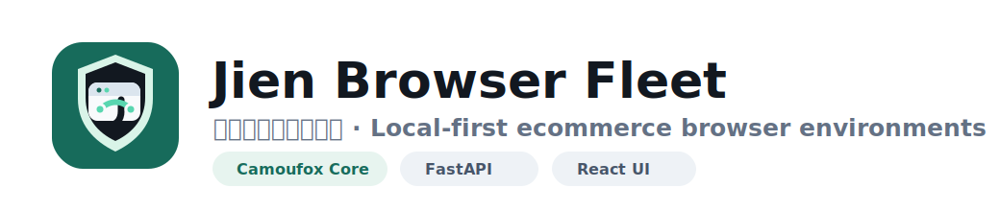

<p align="center">
  
</p>

<p align="center">
  <strong>Local-first browser environment fleet for cross-border ecommerce operators.</strong>
  <br />
  极恩跨境指纹浏览器：用 Camoufox 核心管理店铺、账号、代理、任务和环境风险。
</p>

<p align="center">
  <a href="#quick-start"></a>
  
  
  
  
  
</p>

---

## What Is Jien Browser Fleet?

Jien Browser Fleet is a local browser environment manager built for cross-border ecommerce workflows. It organizes multiple account profiles as a controllable fleet: every profile has its own Camoufox browser data directory, proxy settings, timezone, ecommerce metadata, health status, task shortcuts, logs, screenshots, and exportable data package.

**中文定位**：这是一套本机运行的跨境电商指纹浏览器管理系统，适合管理 TikTok Shop、Amazon、Shopify、社媒账号等多环境运营场景。它优先解决三个问题：

- 多账号环境不混乱：账号、平台、市场、负责人、状态和备注集中管理。
- 代理和时区可复查：代理 IP、代理时区、浏览器时区、语言和运行环境有检测记录。
- 迁移和备份更稳：支持从其他 Camoufox fleet 数据库导入，也支持导出当前系统数据包。

> [!IMPORTANT]
> This project is designed for lawful, consent-based ecommerce operations and local environment management. Do not use it to violate platform rules, bypass security controls, or automate abusive behavior.

## Highlights

| Area | Capability |
| --- | --- |
| Browser core | Launches isolated Camoufox profiles with persistent browser data. |
| Account matrix | Creates profiles and stores platform, brand, market, owner, priority, account status, goals, and notes. |
| Proxy health | Checks proxy IP, country, city, organization, and timezone alignment. |
| Deep environment checks | Reads browser timezone, language, platform, user agent, WebDriver flag, screen and viewport. |
| Ecommerce tasks | Provides quick task templates such as Seller Center, orders, products, ads, creators, Instagram, mail, and IP checks. |
| Data migration | Imports profile metadata and optional browser login data from another Camoufox `fleet.db`. |
| Export package | Exports current data for backup or migration. |
| Local REST API | Exposes profile launch, stop, navigate, screenshot, logs, proxy check, timezone sync, and batch operations. |

## Product Surface

The dashboard is intentionally operational rather than decorative:

- **Account Matrix** for scanning and controlling all profiles.
- **Proxy Health** for prioritizing risky environments.
- **Task Templates** for ecommerce entry points and repeated account work.
- **Operations Inspector** for editing account metadata and running checks from one side panel.
- **Event Log** for launch, stop, navigation, import, export, and batch task traces.

## Tech Stack

- **Backend**: FastAPI, Uvicorn, Pydantic, PyYAML
- **Browser runtime**: Camoufox, BrowserForge, Playwright control channel
- **Proxy utilities**: Requests, PySocks, local SOCKS bridge
- **Frontend**: React, Vite, TypeScript, Lucide React
- **Storage**: Local JSON state, local profile directories, optional imported SQLite `fleet.db`

## Requirements

- macOS
- Python 3.11+
- Node.js 20+
- A working Camoufox installation
- Network/proxy access for IP and timezone checks

The default Camoufox app path can be configured in [`config.yaml`](./config.yaml):

```yaml
camoufox_macos_app: "~/Library/Caches/camoufox/Camoufox.app"
```

## Quick Start

```bash
./run.sh
```

Then open:

```text
http://127.0.0.1:8138
```

`run.sh` will:

1. Create a local Python virtual environment.
2. Install Python dependencies from [`requirements.txt`](./requirements.txt).
3. Install frontend dependencies if needed.
4. Build the React dashboard.
5. Start the FastAPI service.

For faster restarts when the frontend has already been built:

```bash
SKIP_FRONTEND_BUILD=1 ./run.sh
```

## Configuration

Main settings live in [`config.yaml`](./config.yaml):

```yaml
host: 127.0.0.1
port: 8138
data_root: data/profiles
screenshots_root: data/screenshots
state_file: data/state.json
logs_root: logs
max_concurrent_launches: 4
default_start_url: "https://ipwho.is/"
command_timeout_seconds: 45
log_level: INFO
```

Recommended defaults:

- Keep `host` on `127.0.0.1` unless you have a clear reason to expose it.
- Increase `max_concurrent_launches` only after confirming CPU, RAM, proxy quality, and account risk tolerance.
- Keep browser data on a fast local disk when possible.

## Data Migration

The dashboard can import from another local Camoufox fleet directory. The expected source shape is:

```text
/path/to/camoufox-fleet-local
├── data
│   ├── fleet.db
│   └── profiles
│       └── <profile_id>
│           └── browser-data
```

API example:

```bash
curl -X POST http://127.0.0.1:8138/api/import/camoufox-fleet \
  -H "Content-Type: application/json" \
  -d '{
    "source_dir": "/Volumes/Rtl9210/camoufox-fleet-local",
    "copy_browser_data": true,
    "overwrite_browser_data": false
  }'
```

Notes:

- Metadata import reads profile, account, proxy, timezone, locale, screen, and launch URL fields.
- Browser-data copy is optional because it can include cookies, sessions, and login state.
- Locked or running source profiles should be stopped before full browser-data migration.

## Export And Backup

Export the current system data:

```bash
curl -OJ "http://127.0.0.1:8138/api/export/archive?include_browser_data=true"
```

Sensitive paths:

```text
data/state.json
data/profiles/<profile_id>/browser-data
data/exports
logs
```

These may contain proxy credentials, cookies, sessions, screenshots, and operational history. They are intentionally excluded by the root `.gitignore`.

## API Reference

Health:

```bash
curl http://127.0.0.1:8138/health
```

Profiles:

```bash
curl http://127.0.0.1:8138/api/profiles
curl -X POST http://127.0.0.1:8138/api/profiles/<profile_id>/launch \
  -H "Content-Type: application/json" \
  -d '{"start_url":"https://ipwho.is/","headless":false}'
curl -X POST http://127.0.0.1:8138/api/profiles/<profile_id>/stop
```

Runtime actions:

```bash
curl -X POST http://127.0.0.1:8138/api/profiles/<profile_id>/navigate \
  -H "Content-Type: application/json" \
  -d '{"url":"https://seller-us.tiktok.com/"}'

curl -X POST http://127.0.0.1:8138/api/profiles/<profile_id>/screenshot
curl http://127.0.0.1:8138/api/profiles/<profile_id>/logs
curl http://127.0.0.1:8138/api/profiles/<profile_id>/pages
```

Environment checks:

```bash
curl -X POST http://127.0.0.1:8138/api/profiles/<profile_id>/proxy-check
curl -X POST http://127.0.0.1:8138/api/profiles/<profile_id>/sync-timezone
curl -X POST http://127.0.0.1:8138/api/profiles/<profile_id>/deep-check
curl -X POST http://127.0.0.1:8138/api/profiles/<profile_id>/calibrate-environment
```

Batch operations:

```bash
curl -X POST http://127.0.0.1:8138/api/profiles/batch \
  -H "Content-Type: application/json" \
  -d '{"ids":["profile-a","profile-b"],"action":"proxy"}'
```

## Project Structure

```text
.
├── app
│   ├── main.py                 # FastAPI routes and static frontend serving
│   ├── camoufox_core.py         # Profile launch/stop orchestration
│   ├── runner.py                # Per-profile runtime process
│   ├── camoufox_fleet_io.py     # Import/export and browser-data copy
│   ├── ecommerce.py             # Platform task templates
│   ├── proxy_check.py           # Proxy and IP checks
│   └── store.py                 # Local state helpers
├── frontend
│   ├── src/App.tsx              # Main dashboard UI
│   ├── src/styles.css           # Product styling
│   └── public/favicon.svg       # App icon
├── docs/brand                   # Logo and icon assets
├── config.yaml                  # Local runtime configuration
├── requirements.txt             # Python dependencies
└── run.sh                       # One-command local startup
```

## GitHub Upload Checklist

Before publishing:

```bash
git init
git status --short
git add .gitignore README.md app frontend docs config.yaml requirements.txt run.sh scripts
git commit -m "Initial Jien Browser Fleet release"
```

With GitHub CLI:

```bash
gh repo create giien/jien-browser-fleet --private --source=. --remote=origin --push
```

Or push to an existing repository:

```bash
git remote add origin git@github.com:giien/jien-browser-fleet.git
git branch -M main
git push -u origin main
```

Double-check before making it public:

- No `data/` profile folders.
- No exported zip archives.
- No screenshots containing account data.
- No logs with proxy credentials or platform URLs you consider private.
- No `.venv`, `node_modules`, `frontend/dist`, or `__pycache__`.

## Roadmap

- Profile merge assistant for importing one old environment into one new ecommerce profile.
- Safer migration wizard with automatic stop, backup, copy, and rollback.
- Visual diff for environment checks over time.
- Per-platform task recipes and account runbooks.
- Optional encrypted local secret store for proxy credentials.
- Release packaging with a signed macOS app wrapper.

## Support This Project

If Jien Browser Fleet helps your work, research, or operations, you are welcome to support ongoing maintenance and future improvements.

> Sponsorship or donation does not grant commercial rights, trademark rights, redistribution rights, or a commercial license.

<table>
  <tr>
    <td align="center">
      <strong>微信赞赏</strong>
      <br />
      
    </td>
    <td align="center">
      <strong>支付宝赞赏</strong>
      <br />
      
    </td>
  </tr>
</table>

More details: [`SUPPORT.md`](./SUPPORT.md)

## Community And Contact

欢迎跨境卖家、AI 产品开发者、独立开发者，以及对 AI 出海产品感兴趣的朋友加入交流群。适合聊：

- 跨境和出海场景下的 AI 产品开发
- 指纹浏览器、自动化、账号环境和运营工作流
- 增长、获客、内容、设计和产品化经验
- 开发、运营和商业化实践

<table>
  <tr>
    <td align="center">
      <strong>企业微信交流群</strong>
      <br />
      
    </td>
    <td align="center">
      <strong>个人微信联系</strong>
      <br />
      
    </td>
  </tr>
</table>

If you add Giien Global on WeChat, please include a short note such as `仓库反馈`, `合作沟通`, `商用授权`, or `产品交流`.

Community details: [`COMMUNITY.md`](./COMMUNITY.md)

## Security Notes

Jien Browser Fleet is local-first, but local does not mean risk-free:

- Browser profile folders can contain full login sessions.
- Export packages may contain cookies and proxy credentials.
- Screenshots may contain account, order, or platform information.
- Logs can reveal operational timing and profile IDs.

Treat this repository as source code only. Keep runtime data private.

## License

No open-source license has been selected yet. Until a license is added, all rights are reserved by the project owner.

If you intend to publish this repository publicly, choose a license first.
